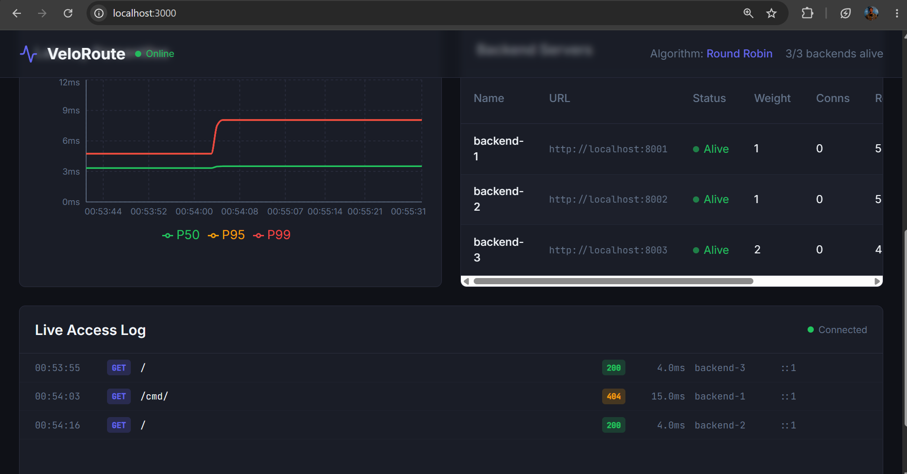
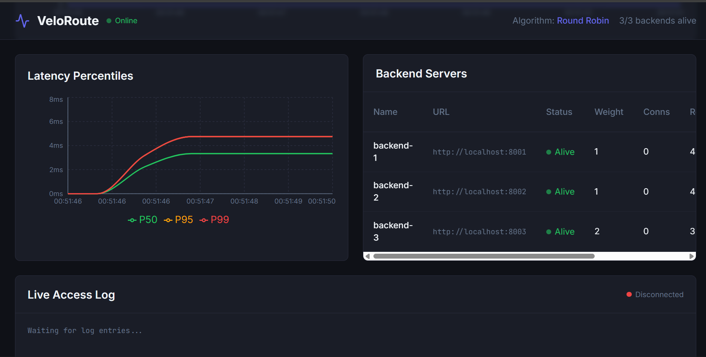
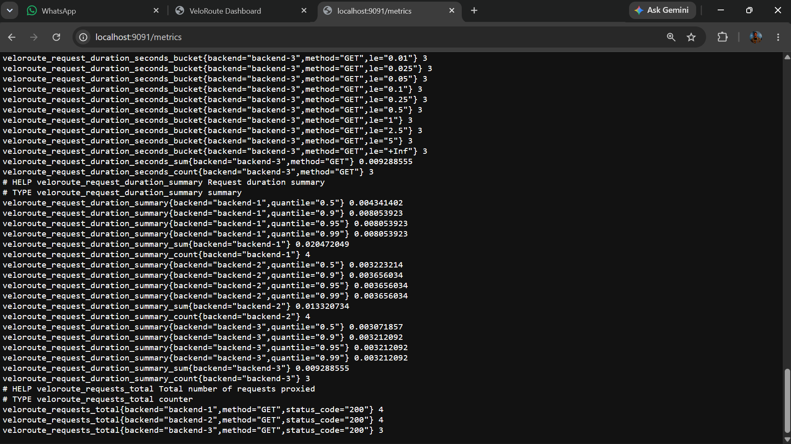

# VeloRoute

A high-performance reverse proxy and load balancer built in Go, with a real-time React dashboard for operators who want visibility without the complexity of a full service mesh.

VeloRoute sits between your users and your backend servers. It distributes traffic, watches backend health, rate-limits noisy clients, and gives you live metrics — all from a single lightweight binary.

**Author:** [Allan Davincs](https://github.com/Allan-Davincs)  
**Repository:** [github.com/Allan-Davincs/VeloRoute-Proxy](https://github.com/Allan-Davincs/VeloRoute-Proxy)

---

## Screenshots

### Admin dashboard

Live metrics, latency charts, backend management, and a scrolling access log feed.





### API health check

Admin API responding with backend status and metrics.



---

## Why VeloRoute?

If you run more than one backend instance, you need something in front of them that can:

- **Spread traffic fairly** — round robin, weighted, least connections, or sticky IP hash
- **Drop dead servers automatically** — active health checks every few seconds
- **Protect your stack** — per-IP token bucket rate limiting
- **Show you what's happening** — Prometheus metrics plus a live dashboard

VeloRoute does all of that without Redis, without a database, and without pulling in a heavy web framework. One Go binary, one YAML config file, optional React dashboard.

---

## What's included

| Layer | What you get |
|-------|----------------|
| **Proxy** | `net/http` reverse proxy on `:8080` |
| **Load balancing** | 4 algorithms, hot-swappable at runtime |
| **Health checks** | Background goroutines with configurable interval |
| **Rate limiting** | Token bucket per client IP |
| **Metrics** | Prometheus scrape endpoint on `:9091` |
| **Admin API** | REST + SSE log stream on `:9090` |
| **Dashboard** | React UI with algorithm switcher and backend management |

---

## Architecture

```
                    ┌─────────────────────────────────────────┐
                    │         Client HTTP Requests            │
                    └────────────────────┬────────────────────┘
                                         │
                                         ▼
                              ┌──────────────────┐
                              │  Proxy :8080     │
                              └────────┬─────────┘
                    ┌──────────────────┼──────────────────┐
                    ▼                  ▼                  ▼
            ┌─────────────┐   ┌─────────────┐   ┌─────────────┐
            │ Rate Limiter│   │ BalancerPool│   │Access Logger│
            └─────────────┘   └──────┬──────┘   └──────┬──────┘
                                     │                  │
                                     ▼                  ▼
                            ┌──────────────┐    ┌──────────────┐
                            │ Backend Pool │    │ SSE Channel  │
                            └──────────────┘    └──────┬───────┘
                                                         │
    ┌────────────────────────────────────────────────────┼────────────┐
    ▼                                                    ▼            ▼
┌─────────────┐                                  ┌─────────────┐  ┌──────────┐
│ Admin API   │◄── dashboard polls /api/metrics ─│  Dashboard  │  │Prometheus│
│ :9090       │◄── SSE /api/logs/stream ─────────│  :3000      │  │ :9091    │
└─────────────┘                                  └─────────────┘  └──────────┘
```

### Port map

| Port | Service |
|------|---------|
| `8080` | Reverse proxy — point your traffic here |
| `9090` | Admin REST API + SSE log stream |
| `9091` | Prometheus `/metrics` |
| `3000` | React dashboard |

---

## Quick start

### Prerequisites

- Go 1.22+
- Node.js 18+
- Docker (optional, for `make dev`)

### Docker (easiest)

```bash
git clone https://github.com/Allan-Davincs/VeloRoute-Proxy.git
cd VeloRoute-Proxy
make dev
```

| URL | What |
|-----|------|
| http://localhost:8080 | Proxied traffic |
| http://localhost:9090/api/metrics | Metrics JSON |
| http://localhost:3000 | Dashboard |

### Local development

**Terminal 1 — test backends:**

```bash
python3 -m http.server 8001 &
python3 -m http.server 8002 &
python3 -m http.server 8003 &
```

**Terminal 2 — VeloRoute:**

```bash
make run-backend
```

**Terminal 3 — dashboard:**

```bash
make run-frontend
```

Generate some traffic:

```bash
for i in $(seq 1 20); do curl -s http://localhost:8080 > /dev/null; done
```

---

## Dashboard features

The dashboard lets you **change the load balancing algorithm** from a dropdown in the header — no restart required. The selection calls `PUT /api/config/algorithm`, which hot-swaps the active balancer while keeping backend state intact.

You can also **add and remove backends** directly from the UI. Fill in name, URL, and weight, then hit Add. Each row has a Remove button that calls the admin API.

---

## Configuration

See [`backend/config.yaml`](backend/config.yaml) for the full schema. Key fields:

```yaml
veloroute:
  listen_addr: ":8080"
  admin_addr: ":9090"
  metrics_addr: ":9091"
  load_balancing:
    algorithm: "round_robin"   # round_robin | weighted_round_robin | least_connections | ip_hash
  rate_limit:
    enabled: true
    requests_per_second: 10
    burst: 20
  backends:
    - url: "http://localhost:8001"
      weight: 1
      name: "backend-1"
```

Switch algorithm at runtime:

```bash
curl -X PUT http://localhost:9090/api/config/algorithm \
  -H "Content-Type: application/json" \
  -d '{"algorithm": "least_connections"}'
```

---

## Admin API

| Method | Path | Description |
|--------|------|-------------|
| `GET` | `/api/backends` | List backends |
| `POST` | `/api/backends` | Add backend |
| `DELETE` | `/api/backends/:url` | Remove backend (base64 URL) |
| `PUT` | `/api/config/algorithm` | Hot-swap load balancing algorithm |
| `GET` | `/api/metrics` | JSON metrics snapshot |
| `GET` | `/api/logs/stream` | SSE access log stream |

---

## Development

```bash
make test      # go test -race + eslint
make build     # compile binary + frontend bundle
make lint      # go vet + eslint
```

---

## Project structure

```
VeloRoute-Proxy/
├── backend/                 # Go reverse proxy
│   ├── cmd/veloroute/       # Entry point
│   └── internal/
│       ├── balancer/        # 4 algorithms + hot-swap Pool
│       ├── proxy/           # Reverse proxy handler
│       ├── admin/           # REST API + SSE
│       ├── health/          # Health checker
│       ├── ratelimit/       # Token bucket limiter
│       └── metrics/         # Prometheus registry
├── frontend/                # React dashboard
├── docs/screenshots/        # README images
├── docker-compose.yml
└── Makefile
```

---

## Roadmap

- TLS termination
- Admin API authentication
- Config file hot-reload
- OpenTelemetry tracing
- Kubernetes manifests

---

## Contact

Built by **Allan Davincs**. Questions, feedback, or collaboration — reach out:

| Channel | Link |
|---------|------|
| **GitHub** | [github.com/Allan-Davincs](https://github.com/Allan-Davincs) |
| **WhatsApp** | [+255 759 637 644](https://wa.me/255759637644) |
| **TikTok** | [@davincsTEch](https://www.tiktok.com/@davincsTEch) |

---

## Disclaimer and contributing notice

This project is open source and shared for learning, experimentation, and legitimate infrastructure use.

**Before you fork, contribute, or deploy VeloRoute in production, please read this:**

1. **No warranty** — VeloRoute is provided as-is, without guarantee of uptime, security, or fitness for any particular purpose. You are responsible for how you use it.

2. **Production hardening is on you** — The admin API (`:9090`) has no authentication by default. Do not expose it to the public internet without adding auth, TLS, and network restrictions.

3. **Forking and contributions** — You are welcome to fork and contribute. If you do:
   - Open a pull request with a clear description of your changes
   - Do not remove author attribution or license notices
   - For major changes, reach out first via WhatsApp (**0759637644**) or GitHub issues so we can align on direction

4. **Misuse** — Do not use VeloRoute to bypass rate limits, attack third-party services, or distribute malware. The author is not liable for misuse of this software.

5. **Support** — Community support is best-effort. For direct questions, contact **WhatsApp: 0759637644** or **TikTok: @davincsTEch**.

---

## License

MIT — see repository for details.
